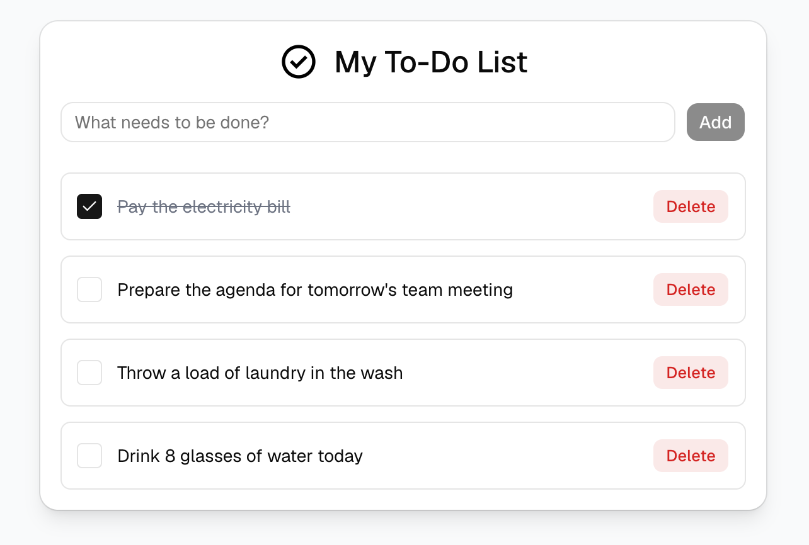

# Todo Application

A full-stack Todo application built with modern web technologies.

**Live Demo:** [https://todo-app-krishna-s-01.vercel.app/](https://todo-app-krishna-s-01.vercel.app/)



## Tech Stack

- Next.js (App Router)
- React
- TypeScript
- Tailwind CSS
- shadcn/ui
- TanStack Query v5
- MongoDB and Mongoose

## Features

- View a list of todos fetched from a MongoDB database.
- Add new todos.
- Toggle the completion status of a todo.
- Delete a todo.
- Smooth UI updates using React Query caching and invalidation.
- Clean and modern user interface utilizing shadcn/ui components.

## Getting Started

First, install the dependencies:

```bash
npm install
```

Set up your environment variables by creating a `.env.local` file at the root of the project. Add your MongoDB connection string. Note: it is recommended to specify a database name at the end of the connection string (for example, `todo-app`).

```env
MONGODB_URI=mongodb+srv://<username>:<password>@cluster.mongodb.net/todo-app
```

Then, run the development server:

```bash
npm run dev
```

Open http://localhost:3000 with your browser to see the result.
